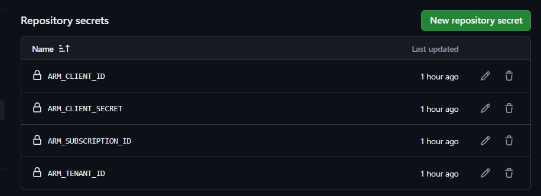
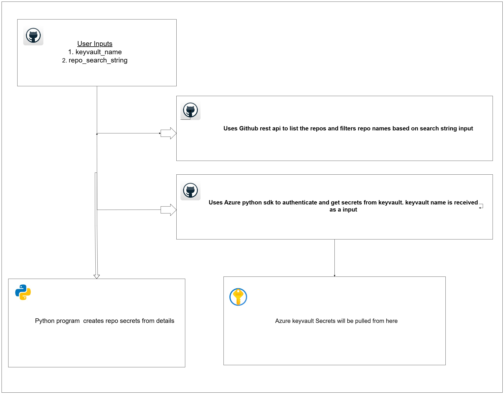

# github-get-secrets-from-azure-kv-and-configure-as-repo-secrets

Fetch Specific Secrets from Azure key vault and configure as repo secrets

# Mandatory Environment variables

* The below one is used to determine the owner of repo. This is a environment variable provided by GitHub.

```commandline
GITHUB_REPOSITORY_OWNER
```

* GH_APP_TOKEN --> This is GitHub App installation token generated by using action `https://github.com/marketplace/actions/create-a-github-app-installation-access-token`
This token is used for all API calls.


# What is been done here

* This is the proof of concept of updating github secrets from SECRETS present in azure KV

* Specific SECRETS are pulled from keyvault and update in multiple repos in a single stretch

* Here we are pulling secrets named ARM-CLIENT-ID and ARM-CLIENT-SECRET in a KV and update them in repo secrets.

* Also TENANT ID and SUBSCRIPTION ID of the KEY vault are also added a github secrets


| Secret name in Keyvault | GitHub Secret name |
|-------------------------|--------------------|
| ARM-CLIENT-ID           | ARM_CLIENT_ID |
| ARM-CLIENT-SECRET       | ARM_CLIENT_SECRET |
| Subscription ID         | ARM_SUBSCRIPTION_ID |
| Tenant ID               | ARM_TENANT_ID |



* `pynacl` is used to encrypt the secrets

* GitHub REST API is used to get details like repo names, repo public keys, repo public key ids etc.

* Auth to GitHub is done using, GitHub App installation token generated by using action `https://github.com/marketplace/actions/create-a-github-app-installation-access-token`
This token is used for all API calls.

* Authentication to Azure is done using azure-identity package using service principal with secret as credentials.
The below envrionment variables are used for authentication and programatical usage

```commandline
AZURE_CLIENT_ID
AZURE_TENANT_ID
AZURE_CLIENT_SECRET
```

# How code works

1. First uses GitHub rest api repo end point to list out all the repositories and filters based on the the search string event
2. Then loops over the repos matching the search input and gets the repo public key and repo public key id
3. Once its done, it authentcates with azure gets the keyvault secrets ready for the above secrets `ARM-CLIENT-ID` & `ARM-CLIENT-SECRET`
4. It will add the service principal to access policies to `secret permissions` - `get`, `list`, `set`
5. Also in mean time it uses azure resource graph queries to get the subscription id, tenant id, key vault resource group etc.
6. Using `public key`, `public key id` and the `secret value` fetched from keyvault using pynacl the secret value is encrypted which is passed to create repo secrets function.
6. Once all the details are fetched like `ARM-CLIENT-ID`, `ARM-CLIENT-SECRET`, `SUBSCRIPTION ID` & `TENANT ID`, it prepares to 
   create github secrets with names `ARM_CLIENT_ID`, `ARM_CLIENT_SECRET`, `ARM_SUBSCRIPTION_ID` & `ARM_TENANT_ID`

